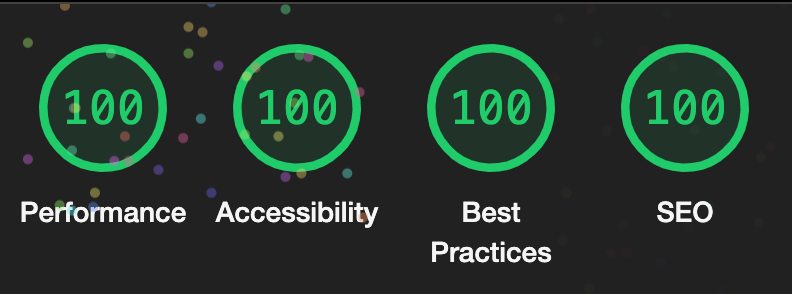

# rayspace.dev
🦀 My portfolio built with Rust and native web technologies.

## Overview
The design of this site is inspired by the work of [Lee Robinson](https://github.com/leerob/leerob.io), but diverges in technical implementation.

This is a full stack application built with rust and core web technologies. It uses Actix Web for the backend and HTML/CSS/JavaScript for the frontend. The project also uses a PostgreSQL database for persistent storage, and utilizes SQLx as an async, pure Rust SQL crate.

For more information, check out the [About This Site](https://www.rayspace.dev/about) section on the live site.

## Technologies Used
* [Rust](https://www.rust-lang.org/)</br>
* [HTML/CSS/JavaScript](https://developer.mozilla.org/en-US/docs/Learn)</br>
* [Actix Web](https://actix.rs/)</br>
* [SQLx](https://github.com/launchbadge/sqlx)</br>
* [PostgreSQL](https://www.postgresql.org/)</br>

## Features
* Single page application functionality with navigation handling and state persistence
* Dynamic rendering of blog posts based on API data
* Handling of guestbook comments with real-time updating
* Management of blog post views
* Syntax highlighting and clipboard functionality for code blocks
* Input validation and sanitization
* Dynamic meta tag updating
* User authentication with GitHub OAuth
* Secure user session management
* Utilizing SQLx for secure database interactions


## Running Locally
If you are familiar with Rust, you can build the app from source and run your own instance. To build and run the application locally, follow these steps:

1. Ensure you have Rust installed. You can install Rust by following the [official guide](https://www.rust-lang.org/tools/install).

2. Clone this repository.
```bash
git clone https://github.com/ryspc/rayspace.dev.git
cd rayspace.dev
```

3. Setup [PostgreSQL](https://www.postgresql.org/download/) and create the tables.
```sql
CREATE TABLE comments (
    id SERIAL PRIMARY KEY,
    userid VARCHAR(255),
    name VARCHAR(255),
    comment TEXT,
    timestamp TIMESTAMP WITH TIME ZONE DEFAULT CURRENT_TIMESTAMP);
```
```sql
CREATE TABLE posts (
    id SERIAL PRIMARY KEY,
    title TEXT NOT NULL,
    published_date DATE NOT NULL,
    views INTEGER NOT NULL);
```

4. Set the required environment variables.
* Create `.env` file at project root.
* Required variables are within `.env.example`.

5. Build and run the application.
```bash
cargo run
```

6. The server will start, by default it runs on `http://localhost:3000`.

7. (Optional) Create a systemd service to run your application persistently.

8. (Optional) Install and configure a loadbalancer such as [HAProxy](http://www.haproxy.org/) for enabling features like HTTP/2 and rate limiting.

## Contributing
Contributions to this project are welcome! Feel free to open issues or submit pull requests.
